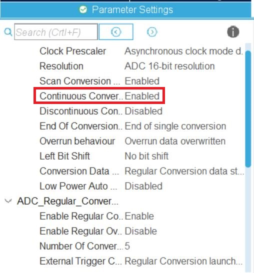

<h1>STM32H7 ADC Multi Channel Continuous Conversion Polling Mode</h1>

<p>Tested with STM32H750 in HAL & LL library, should be able ported to others<p>

This example will convert several channels. ADC conversions are performed successively in a scan sequence.  
Software polls for conversion completion

Setup ADC3 to measure 2 channel(INP0 & INP1) & 3 internal channel(VRefInt, VBat & TempSensor)


Remember to enable Continuous Convertion mode



Since this example is not for speed, we set long sampling time.  
The Rank Setting:


ADC value is convert to voltage/temperature with build in macro  
The Output in Live Expression:


HAL library is quite straight forward and simple, while LL took me some time to make it run.  
Few command that had cause me some time to figure out after reference to other example in forum.

```c
  LL_ADC_SetChannelPreSelection(ADC3, LL_ADC_CHANNEL_VREFINT);
  LL_ADC_SetChannelPreSelection(ADC3, LL_ADC_CHANNEL_0);
  LL_ADC_SetChannelPreSelection(ADC3, LL_ADC_CHANNEL_1);
  LL_ADC_SetChannelPreSelection(ADC3, LL_ADC_CHANNEL_VBAT);
  LL_ADC_SetChannelPreSelection(ADC3, LL_ADC_CHANNEL_TEMPSENSOR);
```
```c
  LL_ADC_SetCommonPathInternalCh(__LL_ADC_COMMON_INSTANCE(ADC3),
		  LL_ADC_CHANNEL_VREFINT | LL_ADC_CHANNEL_VBAT |
		  LL_ADC_CHANNEL_TEMPSENSOR);
``` 

<p>Comment/Suggestion are highly welcome!</p>